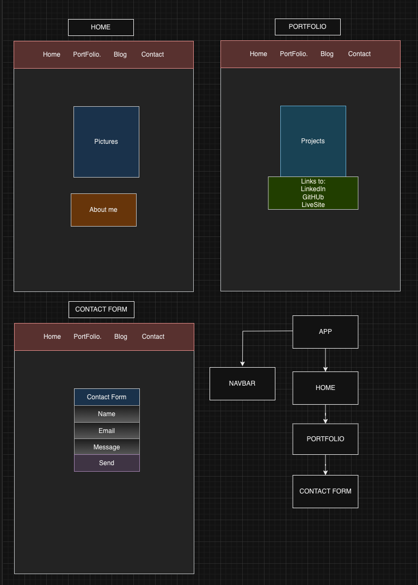

# Portfolio
This is a project to complete the first module of my Software Engineering certification @Per Scholas

**How is the game played?** 
The player selects the first card, the card flipps. When the second card is selected, if they match: cards keep being flipped. If cards don't match, they will both flip back. Player keeps selecting cards, two by two, either until all cards are selected or time runs out.

### Live version: (https://vanessaxb.github.io/Memory-Game/)

## Features

**Win state**: all cards are matched within timer.

**Lose state**: cards are not macthed within timer.

**Multiple rounds**: cards will be automaticly shuffled and ready to play again when current game round is over.

**Reset Game**: at any time, player can choose to click on the New Game button to restard the game.

**Click Count**: added a click count tracker for scoring. 

## Tech Stack
    1. HTML
    2. CSS with FlexBox and Tailwind
    3. JavaScript
    4. React 

**The purpose is to demonstrate my knowledge of:**

    * Semantic HTML and application structure
    * Styling and appearance using CSS including FlexBox
    * Dynamic events and interactions utilizing JavaScript
    * Classes and Object Oriented Programming
    * DOM manipulation

## Challenges
I had two main challenges:
1. I chose to compare cards using their class id and not names. This was done by this line: card.setAttribute('data-id', picturesCollection[i]);
As you can see on elements, this code line made 'data-id' = card names, therefore, I could compare them.

2. My flipping wasn't showing the back of my card. To solve that, on the createFrame function I had to add 2 more div's, each representing a card's face (front/back) so that I could toggle them using the flipping function.

## Images
#### WireFaame

#### Win State

#### Lose State

## Resources
