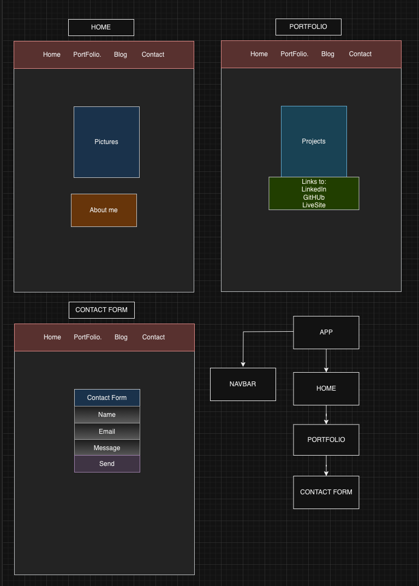

# Portfolio
This is my tech portfolio webpage.

### Deployed version: (https://vanessab.netlify.app/)

## Features

*** Carousel user interface module.

*** Backend free contact form EmailJS.

*** Unsplash for API.

## Tech Stack
    1. HTML
    2. CSS with FlexBox and Tailwind
    3. JavaScript
    4. React/Redux 

**The purpose is to demonstrate my knowledge of:**

    * Semantic HTML and application structure
    * Styling and appearance using CSS including FlexBox and Tailwind
    * Dynamic events and interactions utilizing JavaScript
    * Classes and Object Oriented Programming
    * DOM manipulation
    * React Library
    * Use Fetch and UseEffect to make a request to an external data source (API)
    

## Challenges
The main challenge I had was learning how to style my pages using TailWind. It was completely new to me but now I'm addicted to it :-)

## Images
#### WireFaame

## Resources
#### React Library: (https://legacy.reactjs.org/)

#### TailWind: (https://tailwindcss.com/docs/adding-custom-styles)

#### Unsplash: (https://unsplash.com/)

#### EmailJs: (https://www.emailjs.com/docs/examples/reactjs/)